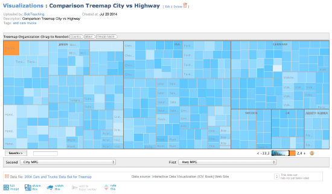

*Note: You need to produce 5 of these*

### Description

Visual Design Type: 
: Treemap

Name of Tool: 
: IBM ManyEyes

Country: 
: Germany, Japan, South Korea, Sweden, UK, U.S.

Year: 
: 2014

Visual Mappings:
: 
: * **color**: color is mapped to the difference between city and highway MPG for each car
: * **shape**: each bottom level rectangle represents a car type
: * **size**: the of each bottom-level rectangle is mapped to the difference in mpg between the city and highway MPG of each car type.
: * **position**: the position of each rectangle / car is determined by decreasing frequency, the more cars manufactured, the further to the left.
: * **hierarchy**: the cars are grouped by country of manufacturer $\rightarrow$ make $\rightarrow$ vehicle name

Unique Observation: 
: We can clearly see an outlier, i.e., that the Toyota is the only car with 
  greater city MPG than highway MPG.  We can also see that South Korea 
  produces cars.  I did not know this previously.  
  
Data Preparation:
: In order to create the hierarchy, the country of origin for each car has 
  to be included in the spreadsheet as an additional column.

